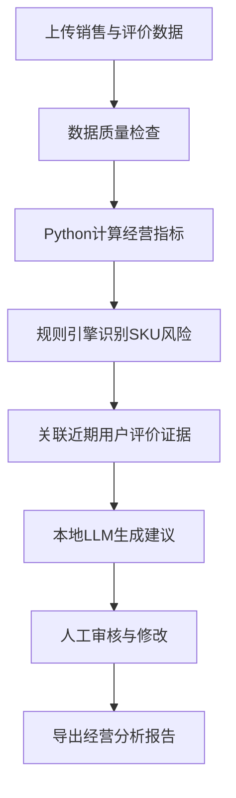

# GrowthPilot

An evidence-grounded sales and SKU analysis agent for FMCG e-commerce operations.

GrowthPilot 是一款面向快消品牌电商运营人员的本地经营分析 Agent。它能够读取销售、库存、广告和用户评价数据，通过 Python 计算经营指标、识别 SKU 风险，再使用本地大模型生成有证据约束的运营建议。

> 当前版本使用模拟数据，仅用于产品设计和技术演示。AI建议不能自动执行，必须经过人工审核。

## 产品背景

快消电商运营人员通常需要从多个 Excel 文件中整理销售、库存、广告和用户评价数据，主要存在以下问题：

- 数据分散，人工统计耗时。
- SKU数量较多，异常发现不及时。
- 销量下降后，难以快速定位影响环节。
- 经营数据与消费者评价缺少关联。
- 通用大模型可能计算错误或生成没有数据依据的建议。

GrowthPilot 将可验证的数据计算、规则诊断和本地大模型结合，用于辅助运营人员完成从发现问题到形成行动建议的过程。

## 核心工作流



## 核心功能

- 销售经营 CSV 上传
- 用户评价 CSV 上传
- 数据字段与格式验证
- GMV、销量、毛利和毛利率计算
- 广告 ROI、点击率和转化率计算
- 退货率和库存可售天数计算
- SKU 经营表现汇总
- 销量下降、库存不足和广告效率风险识别
- 用户评价主题与负面率分析
- 销售风险与用户评价证据关联
- 本地 Ollama 运营建议生成
- AI建议人工修改、采纳或拒绝
- Markdown 经营报告导出
- 自动化指标和风险测试

## 系统架构

GrowthPilot 使用“确定性分析 + 生成式AI”的混合架构。

| 模块 | 主要职责 |
|---|---|
| Python / Pandas | 数据清洗、指标计算、数据聚合 |
| 规则诊断引擎 | 识别销量、库存和广告风险 |
| 评价分析模块 | 识别评价主题并计算负面率 |
| Ollama / qwen2.5:3b | 解释已识别风险并生成建议 |
| Streamlit | 数据上传、图表、审核和报告导出 |
| Pytest | 验证指标公式和风险识别结果 |

## AI职责边界

Python负责：

- 数据验证
- 指标计算
- SKU聚合
- 异常检测
- 评价主题统计
- 证据生成

本地大模型负责：

- 总结已经确认的风险
- 生成需要人工执行的检查建议
- 提出需要补充的数据
- 生成报告文字

大模型不得：

- 自行计算关键经营指标
- 编造销量、利润、库存或评价数字
- 将相关性直接描述为因果关系
- 自动修改价格、库存或广告预算
- 绕过人工审核执行建议

## 示例分析场景

模拟数据中预先设计了以下风险：

| SKU | 模拟场景 | 系统预期结果 |
|---|---|---|
| SKU001 | 最近7天销量明显下降，同时负面评价增加 | 识别销量下降并关联口味评价 |
| SKU003 | 广告费用大幅增加，但销量没有同步增长 | 识别广告效率风险 |
| SKU004 | 库存不足并伴随销量下降 | 同时展示库存与销量风险 |

这些已知场景用于验证规则引擎是否能够发现预期问题，不代表真实企业环境中的模型准确率。

## 项目结构

```text
Growthpilot-fmcg-agent/
├── app.py
├── requirements.txt
├── data/
│   ├── sample_sales.csv
│   └── sample_reviews.csv
├── docs/
│   ├── PRODUCT_BRIEF.md
│   └── DATA_DICTIONARY.md
├── scripts/
│   └── generate_sample_data.py
├── src/
│   ├── agent.py
│   ├── diagnosis.py
│   ├── metrics.py
│   └── reviews.py
└── tests/
    ├── test_agent.py
    ├── test_diagnosis.py
    └── test_metrics.py
```

## 本地运行

### 1. 环境要求

- Python 3.11
- Ollama
- qwen2.5:3b

### 2. 创建虚拟环境

```bash
python3.11 -m venv .venv
source .venv/bin/activate
```

### 3. 安装依赖

```bash
python -m pip install -r requirements.txt
```

### 4. 下载本地模型

```bash
ollama pull qwen2.5:3b
```

### 5. 生成模拟数据

```bash
python scripts/generate_sample_data.py
```

### 6. 运行测试

```bash
python -m pytest -q
```

### 7. 启动网页

```bash
.venv/bin/python -m streamlit run app.py
```

浏览器打开终端显示的本地地址，通常为：

```text
http://localhost:8501
```

## 评估方法

项目当前通过以下方式评估：

- 使用答案已知的小样本验证指标公式。
- 使用预先植入的异常验证风险召回情况。
- 检查AI提示词是否包含原始证据和禁止事项。
- 人工检查AI是否编造数字或进行无依据归因。
- 记录建议被采纳、修改后采纳或拒绝的状态。

未来可以在获得真实标注数据后，进一步评估异常识别准确率、建议采纳率和无依据建议比例。

## 当前限制

- 当前只支持 CSV 文件。
- 使用模拟数据，未连接真实电商平台 API。
- 评价主题目前基于透明关键词规则。
- 异常阈值需要根据企业和品类进行配置。
- 本地模型能力受设备性能和模型规模限制。
- 当前版本不会自动执行任何经营决策。

## 产品文档

- [产品定义](docs/PRODUCT_BRIEF.md)
- [数据字典](docs/DATA_DICTIONARY.md)

## 技术栈

Python · Pandas · Streamlit · Plotly · Ollama · Pytest

## License

MIT License